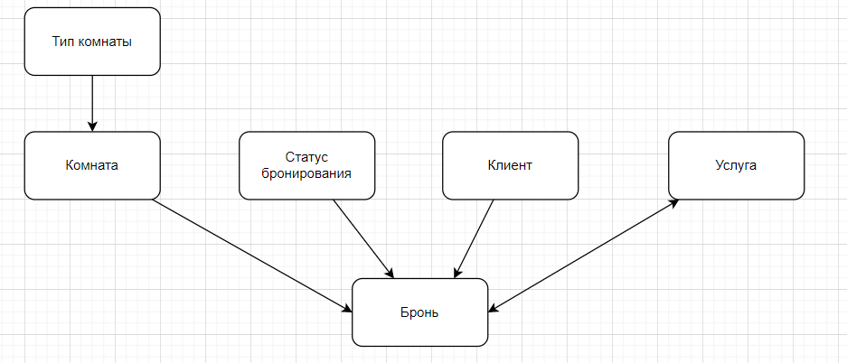
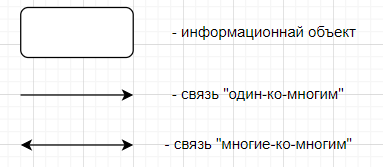
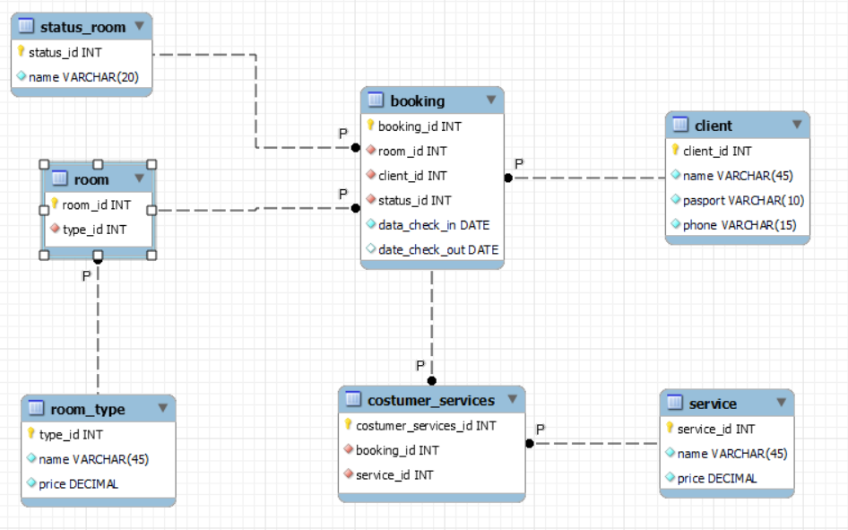

# Разработка приложения для предметной области «Отель»

## 1. Описание предметной области

В некотором отеле происходит бронирование номеров клиентами. У каждой брони есть комната проживания, период проживания, клиент и статус бронирования. При бронировании обязательно указывается дата начала бронирования, а дата конца бронирования может не указываться. Каждое бронирование имеет уникальный номер.

В отеле есть комнаты, которые будут снимать клиенты. У каждой комнаты есть уникальный номер, тип и посуточная стоимость.

Пользователями отеля являются клиенты, о которых в базе данных хранится информация о фамилии, паспорте и телефоне. Каждый клиент может забронировать свободный номер на некоторый период или же отменить свою бронь. 

Также пользователь может выбирать различные услоги, у которых есть стоимость и уникальный номе. Клиенты могут заказывать несколько услуг.

## 2. Проектирование базы данных

Процесс проектирования базы данных представляет собой последовательность переходов от словесного описания информационной структуры предметной области к формализованному описанию объектов предметной области в терминах некоторой модели. В общем случае выделяют следующие этапы проектирования: 

1. Анализ и описание предметной области информационной системы. 
2. Концептуальное моделирование. 
3. Построение логической модели.
4. Построение физической модели.

### 2.1. Концептуальная модель

На основе анализа предметной области «Отель», были выделены следующие информационные объекты, которые необходимо хранить в базе данных: ТИП_КОМНАТЫ, КОМНАТА, КЛИЕНТ, СТАТУС_БРОНИРОВАНИЯ, УСЛУГА, БРОНИРОВАНИЕ.

Каждый из выделенных информационных объектов имеет следующие атрибуты:
	ТИП_КОМНАТЫ − название типа, стоимость;
	КОМНАТА − номер комнаты;
	КЛИЕНТ − ФИО, паспорт, телефон;
	СТАТУС_БРОНИРОВАНИЯ − название статуса;
	УСЛУГА − название услуги, стоимость;
	БРОНИРОВАНИЕ − дата начала бронирования, дата окончания бронирования.

На рисунке 1 приведена концептуальная модель предметной области «Отель» в виде ER-диаграммы.



Рис. 1. Концептуальная схема базы данных «Отель»

Для этой диаграммы приняты следующие обозначения



### 2.2. Логическая модель

На рисунке 2 приведена логическая модель базы данных «Отель».



Рис. 2. Логическая схема базы данных «Отель»

### 2.3. Физическая модель

В результате проектирования базы данных были получены информационные объекты, реализованные в виде реляционных таблиц. Ниже приведены SQL-запросы для их создания, в Приложении А приведено наполнение таблиц базы данных.

```SQL
-- Таблица: ТИП_КОМНАТЫ  
DROP TABLE IF EXISTS room_type;  
  
CREATE TABLE IF NOT EXISTS room_type(  
    type_id INTEGER PRIMARY KEY AUTOINCREMENT,  
    name VARCHAR(45) NOT NULL,  
    price DECIMAL NOT NULL  
);

-- Таблица: КОМНАТА  
DROP TABLE IF EXISTS room;  
  
CREATE TABLE IF NOT EXISTS room(  
    room_id INTEGER PRIMARY KEY,  
    type_id INT NOT NULL,  
    FOREIGN KEY (type_id) REFERENCES room_type (type_id) ON DELETE RESTRICT ON UPDATE CASCADE  
);

-- Таблица: КЛИЕНТ  
DROP TABLE IF EXISTS client;  
  
CREATE TABLE IF NOT EXISTS client(  
    client_id INTEGER PRIMARY KEY AUTOINCREMENT,  
    name VARCHAR(45) NOT NULL,  
    passport VARCHAR(10) NOT NULL UNIQUE,  
    phone VARCHAR(15) NOT NULL UNIQUE  
);

-- Таблица: СТАТУС_КОМНАТЫ  
DROP TABLE IF EXISTS status_room;  
  
CREATE TABLE IF NOT EXISTS status_room(  
    status_id INTEGER PRIMARY KEY AUTOINCREMENT,  
    name VARCHAR(20) NOT NULL  
);

-- Таблица: БРОНИРОВАНИЕ  
DROP TABLE IF EXISTS booking;  
  
CREATE TABLE IF NOT EXISTS booking(  
    booking_id INTEGER PRIMARY KEY AUTOINCREMENT,  
    room_id INT NOT NULL,  
    client_id INT NOT NULL,  
    status_id INT NOT NULL,  
    date_check_in DATE NOT NULL,  
    date_check_out DATE NULL,  
    FOREIGN KEY (room_id) REFERENCES room (room_id) ON DELETE RESTRICT ON UPDATE CASCADE,  
    FOREIGN KEY (client_id) REFERENCES client (client_id) ON DELETE CASCADE ON UPDATE CASCADE,  
FOREIGN KEY (status_id) REFERENCES status_room (status_id) ON DELETE RESTRICT ON UPDATE CASCADE  
);

-- Таблица: УСЛУГА  
DROP TABLE IF EXISTS service;  
  
CREATE TABLE IF NOT EXISTS service (  
    service_id INTEGER PRIMARY KEY AUTOINCREMENT,  
    name VARCHAR(45) NOT NULL,  
    price DECIMAL NOT NULL  
);

-- Таблица: УСЛУГА_ДЛЯ_КЛИЕНТА  
DROP TABLE IF EXISTS costumer_services;  
  
CREATE TABLE IF NOT EXISTS costumer_services (  
    costumer_services_id INTEGER PRIMARY KEY AUTOINCREMENT,  
    booking_id INT NOT NULL,  
    service_id INT NOT NULL,  
    FOREIGN KEY (booking_id) REFERENCES booking (booking_id) ON DELETE CASCADE ON UPDATE CASCADE,  
    FOREIGN KEY (service_id) REFERENCES service (service_id) ON DELETE RESTRICT ON UPDATE CASCADE  
);
```

## ПРИЛОЖЕНИЕ А. Наполнение таблицы

```SQL
-- Заполнение: ТИП_КОМНАТЫ  
INSERT INTO room_type(name, price)  
VALUES  
    ('Одноместный', 500.0),  
    ('Двухместный', 975.0),  
    ('Четырёхместный', 1800.0),  
    ('Полу-Вип', 3962.0),  
    ('Вип', 5000.0);

-- Заполнение: КОМНАТА  
INSERT INTO room(room_id, type_id)  
VALUES  
     (101, 1),  
     (102, 1),  
     (103, 1),  
     (104, 1),  
     (105, 1),  
     (106, 2),  
     (107, 2),  
     (108, 2),  
     (109, 2),  
     (110, 2),  
     (201, 3),  
     (202, 3),  
     (203, 3),  
     (204, 3),  
     (205, 3),  
     (206, 3),  
     (207, 3),  
     (208, 3),  
     (209, 3),  
     (210, 3),  
     (301, 4),  
     (302, 4),  
     (303, 4),  
     (304, 5),  
     (305, 5);

-- Заполнение: КЛИЕНТ  
INSERT INTO client(name, passport, phone)  
VALUES  
    ('Петров И.В.', '1010234501', '8-999-251-18-01'),  
    ('Иванов Ф.П.', '1010181902', '8-999-251-18-02'),  
    ('Абрамов В.С.', '1010202003', '8-999-251-18-03'),  
    ('Сергеева В.К.', '1010373304', '8-999-251-18-04'),  
    ('Кандратьев А.Д.', '1010111105', '8-999-251-18-05'),  
    ('Селезнёв Э.Т.', '1011363304', '8-800-555-35-35'),  
    ('Румянцев Д.В.', '1021567899', '8-999-251-18-06'),  
    ('Хлебников Р.И.', '1307157842', '8-999-251-18-07'),  
    ('Кружкина И.В.', '1625364964', '8-999-251-18-08'),  
    ('Кубышкин В.В.', '7221431702', '8-999-251-18-09'),  
    ('Крошкина Н.С.', '4518921836', '8-999-251-18-10'),  
    ('Малышкин С.Э.', '9617221136', '8-999-251-18-11'),  
    ('Глинцов М.А.', '1010202004', '8-999-251-18-12'),  
    ('Мышкина А.М', '1010202005', '8-999-251-18-13'),  
    ('Сычев К.Л.', '1010202006', '8-999-251-18-14'),  
    ('Шпак Г.Ш.', '1010202007', '8-999-251-18-15');

-- Заполнение: СТАТУС_КОМНАТЫ  
INSERT INTO status_room(name)  
VALUES  
    ('забронирована'),  
    ('отмененена');

-- Заполнение: БРОНИРОВАНИЕ  
INSERT INTO booking(room_id, client_id, status_id, date_check_in, date_check_out)  
VALUES  
    (101, 1, 2, '2022-10-01', '2022-10-18'),  
    (102, 1, 1, '2022-10-01', '2022-10-21'),  
    (103, 2, 1, '2022-10-04', '2022-10-15'),  
    (104, 3, 1, '2022-10-01', '2022-10-04'),  
    (105, 10, 1, '2022-10-01', ''),  
    (107, 9, 2, '2022-10-12', '2022-10-21'),  
    (109, 9, 1, '2022-10-10', '2022-10-18'),  
    (101, 8, 1, '2022-10-18', '2022-11-30'),  
    (301, 7, 1, '2022-10-01', '2022-10-05'),  
    (305, 6, 1, '2022-10-01', '2022-10-05'),  
    (106, 4, 1, '2022-09-30', '2022-10-07'),  
    (108, 5, 1, '2022-09-30', '2022-10-07'),  
    (110, 6, 1, '2022-09-30', '2022-10-07'),  
    (201, 16, 2, '2022-10-07', '2022-10-21'),  
    (201, 15, 1, '2022-10-05', '2022-10-21'),  
    (202, 14, 1, '2022-10-02', '2022-10-18'),  
    (203, 13, 1, '2022-10-06', '2022-10-22'),  
    (204, 12, 1, '2022-10-03', '2022-10-19'),  
    (205, 11, 1, '2022-10-05', '2022-10-21'),  
    (206, 9, 1, '2022-11-02', '2022-12-04'),  
    (101, 3, 1, '2022-11-10', '2022-11-27'),  
    (207, 4, 2, '2022-10-15', '2022-11-21'),  
    (208, 1, 1, '2022-10-15', '2022-10-21'),  
    (209, 4, 1, '2022-10-15', '2022-10-31'),  
    (210, 2, 1, '2022-10-01', '2022-10-21'),  
    (210, 3, 1, '2022-12-29', '2023-01-11'),  
    (301, 8, 1, '2022-12-28', '2023-01-11'),  
    (302, 9, 1, '2022-12-31', '2023-01-15'),  
    (303, 1, 1, '2022-12-29', '2023-01-01'),  
    (304, 5, 1, '2022-12-30', '2023-01-07'),  
    (305, 7, 1, '2022-12-28', '2023-01-05');

-- Заполнение: УСЛУГА  
INSERT INTO service(name, price)  
VALUES  
    ('Завтрак в постель', 200.50),  
    ('Уборка в комнате', 350.0),  
    ('Экскурсия_1', 400.35),  
    ('Экскурсия_2', 578.98),  
    ('Экскурсия_3', 750.0),  
    ('Шветский стол', 650.0),  
    ('Мороженое', 100.0);

-- Заполнение УСЛУГА_ДЛЯ_КЛИЕНТА  
INSERT INTO costumer_services(service_id, booking_id)  
VALUES  
    (9, 1),  
    (9, 6),  
    (9, 7),  
    (10, 1),  
    (10, 6),  
    (10, 7),  
    (1, 4),  
    (2, 5),  
    (5, 1),  
    (5, 3),  
    (5, 1),  
    (5, 7),  
    (5, 1),  
    (5, 2),  
    (5, 1),  
    (5, 4),  
    (5, 5),  
    (10, 6),  
    (10, 7),  
    (26, 1),  
    (26, 3),  
    (26, 2),  
    (26, 4),  
    (26, 1),  
    (26, 5),  
    (26, 7);
```